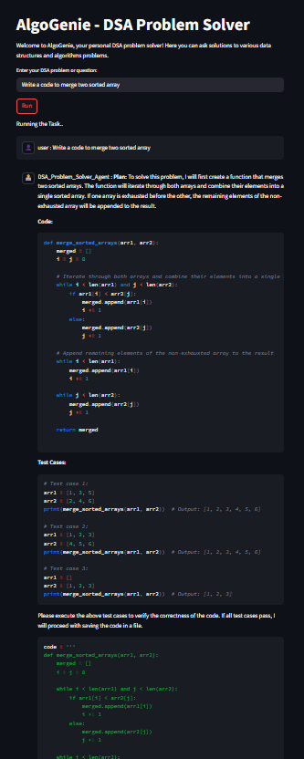

# 🧠 AlgoGenie – AI-Powered DSA Problem Solver

AlgoGenie is an autonomous, AI-powered agent that understands, solves, and explains Data Structures & Algorithms (DSA) problems through natural language input. Built using the [AutoGen](https://github.com/microsoft/autogen) framework, it mimics human reasoning through multi-agent collaboration to generate accurate and optimized Python solutions.

---

## 🚀 Features

- 🧠 **Multi-Agent Coordination**: Uses AutoGen's agent framework to divide and solve tasks intelligently.
- 🧑‍💻 **Natural Language to Code**: Accepts DSA problems in plain English and generates complete Python solutions.
- 🧪 **Isolated Execution Environment**: Executes user code securely using Docker.
- 🌐 **Interactive Web Interface**: Built with Streamlit for a user-friendly frontend experience.
- 📝 **Code Explanation**: Provides step-by-step explanations for each solution.

---

## 📸 Demo

 <!-- Add an actual screenshot path -->

---

## 🧰 Tech Stack

- **[AutoGen](https://github.com/microsoft/autogen)** – Multi-agent framework for LLM coordination  
- **Python** – Core logic and agent interaction  
- **Docker** – Secure code execution environment  
- **Streamlit** – Frontend interface for user interaction  

---

## 🛠️ Setup Instructions

### 1. Clone the Repository
```bash
git clone https://github.com/aijulhussain/DSA-Problem-Solver.git
cd DSA-Problem-Solver/AlgoGenie


### 2. set up
uv venv
.venv/Scripts/activate  # for Windows
uv add -r requirements.txt

Ensure Docker is installed and running. The app uses Docker for sandboxed code execution.

steamlit run app.py
